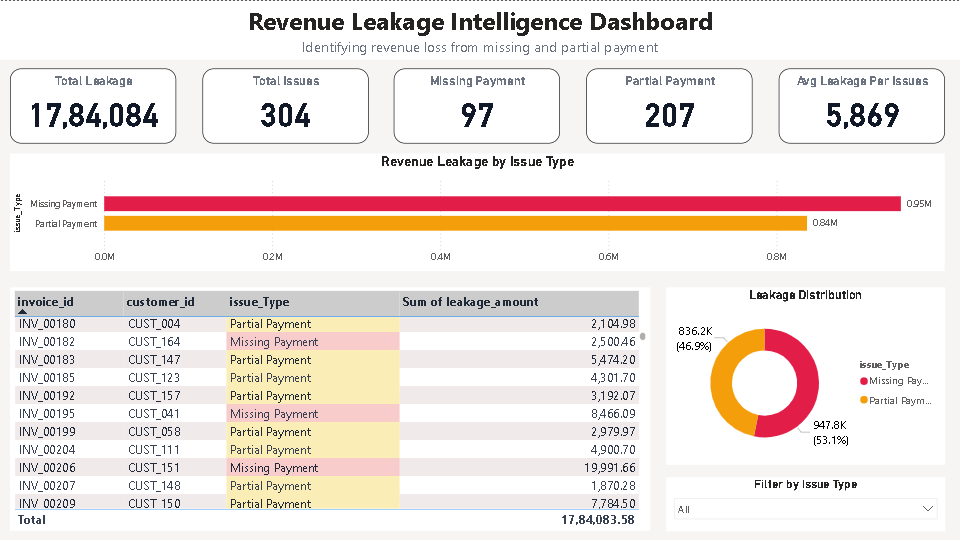

# Revenue Risk Intelligence System

## 📊 Overview
This project is an end-to-end analytics system designed to identify revenue leakage and assess financial risk arising from missing and partial payments.

It integrates Python for data generation, SQL for analytical processing, and Power BI for interactive visualization to deliver actionable business insights.

---

## 🎯 Business Problem
Organizations often face significant revenue loss due to:

- Missing payments (no transaction recorded against invoices)
- Partial payments (incomplete settlements leading to outstanding balances)

These issues are difficult to track at scale and can directly impact financial performance.

---

## 🚀 Solution Approach

This system addresses the problem through a structured analytics pipeline:

### 1. Data Generation (Python)
- Created synthetic invoice and payment datasets
- Simulated real-world financial transactions

### 2. Data Analysis (SQL)
- Identified invoices with missing payments
- Calculated partial payments and quantified leakage amounts
- Generated structured outputs for downstream analysis

### 3. Data Visualization (Power BI)
- Built an interactive report to monitor revenue risk
- Consolidated issues into a unified analytical layer
- Enabled dynamic filtering and drill-down capabilities

---

## 📈 Key Metrics

- Total Revenue Leakage  
- Total Issues Identified  
- Missing Payments Count  
- Partial Payments Count  
- Average Leakage per Issue  

---

## 📊 Dashboard Preview

---

## 💡 Key Insights

- Missing payments contribute significantly to overall revenue leakage  
- A small subset of customers drives a large portion of financial risk  
- Early identification enables prioritization of high-impact recovery actions  

---

## 🛠 Tools & Technologies

- Power BI (Data Visualization & Dashboarding)  
- SQL (Data Analysis & Transformation)  
- Python (Data Generation & Preprocessing)  

---

## 📁 Project Structure

- dashboard/ → Final Power BI report and preview  
- data/ → Raw and processed datasets  
- sql/ → SQL queries for leakage analysis  
- python/ → Data generation and analytical scripts  

---

## 💼 Business Impact

This system enables organizations to:

- Detect revenue leakage proactively  
- Identify high-risk transactions and customers  
- Improve financial control and recovery strategies  
- Support data-driven decision-making  

---

## 🔍 Project Highlights

- End-to-end analytics workflow (Python → SQL → Power BI)  
- Real-world business problem simulation  
- Clean and structured data modeling  
- Interactive and insight-driven dashboard design  

---

## 📌 Conclusion

The Revenue Risk Intelligence System demonstrates how data analytics can be leveraged to uncover hidden financial risks, improve operational visibility, and drive strategic decision-making in revenue management.
